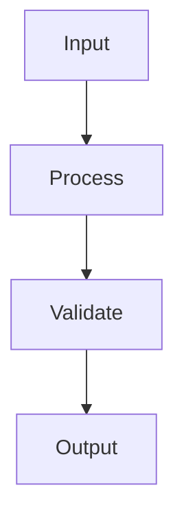

# Phase <NUMBER>: <NAME>

## Goal

<WHAT_THIS_PHASE_DELIVERS>

## Changed Files

- `<path>`: <why it changed>

## Key Decisions

- <decision and reason>

## Flow



## Validation

```powershell
<COMMAND>
```

Result: `<RESULT>`

## Risks

- <risk and mitigation>

## Code Review Focus

- <what reviewer should verify>
