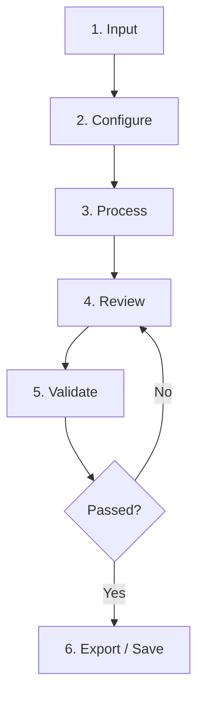

# Workflow

```mermaid
flowchart TD
    A["1. Input"] --> B["2. Configure"]
    B --> C["3. Process"]
    C --> D["4. Review"]
    D --> E["5. Validate"]
    E --> F{"Passed?"}
    F -- "No" --> D
    F -- "Yes" --> G["6. Export / Save"]
```

## User Steps

1. <STEP_1>
2. <STEP_2>
3. <STEP_3>
4. <STEP_4>
5. <STEP_5>

## Important Notes

- <NOTE_1>
- <NOTE_2>
