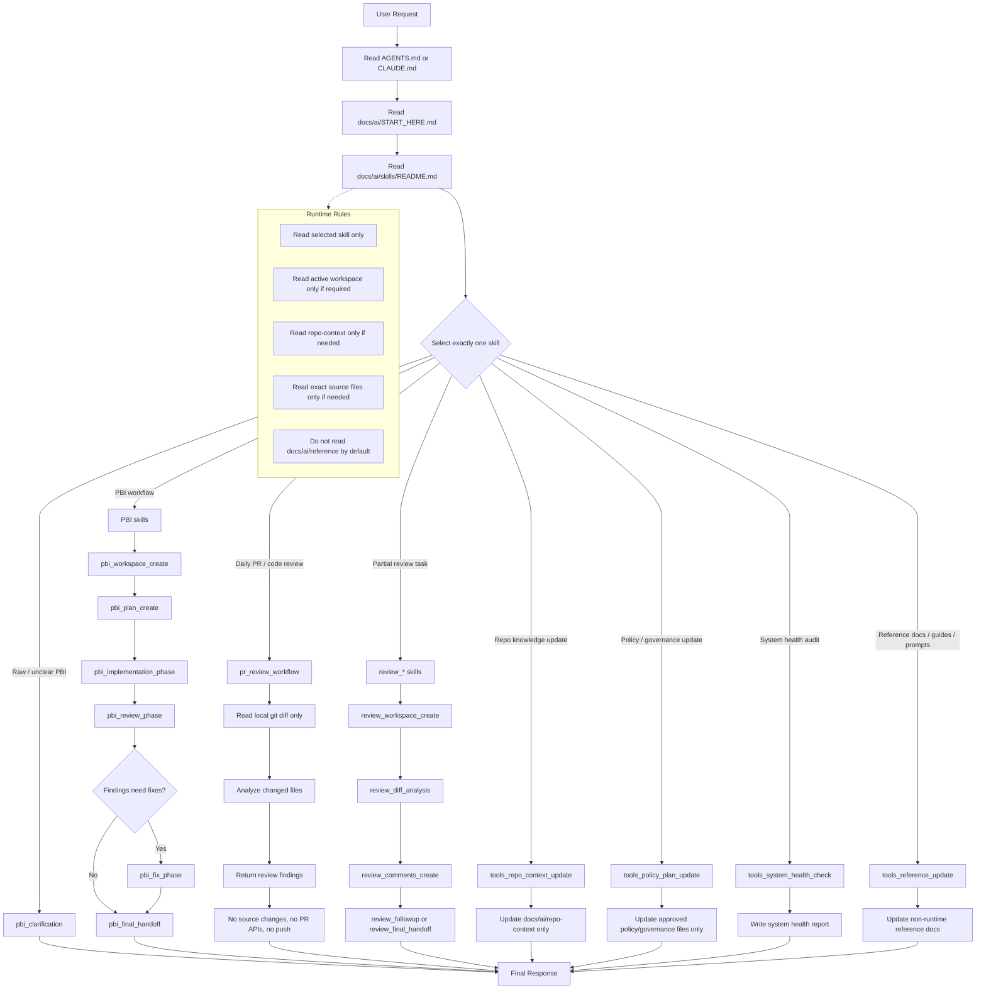

**Workflow Diagram**



خلاصه عملی استفاده:

```text
User Request
-> AGENTS.md / CLAUDE.md
-> docs/ai/START_HERE.md
-> docs/ai/skills/README.md
-> انتخاب یک skill
-> خواندن فقط همان skill
-> اجرای همان workflow
-> آپدیت فقط فایل‌هایی که skill اجازه می‌دهد
-> Final Response
```

اصل مهم سیستم این است: هر درخواست باید به یک skill مشخص route شود، نه اینکه agent کل `docs/ai` یا کل repo را بخواند.
