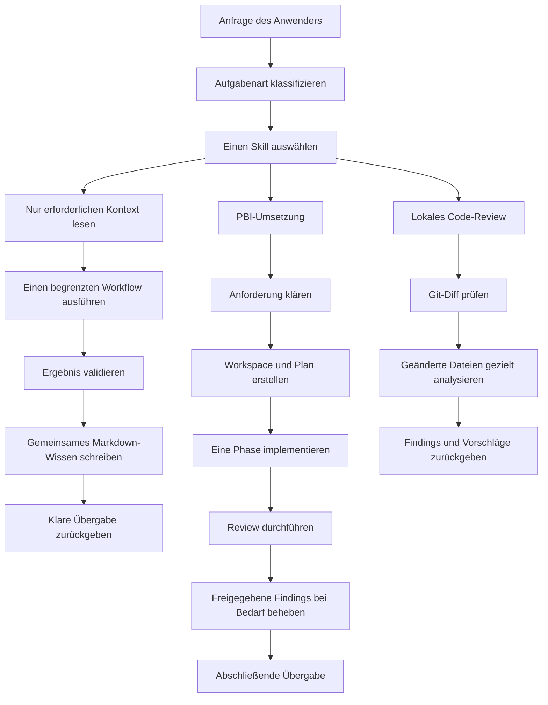

# AI Workflow Coding

## Ein einfaches Betriebssystem für zuverlässige KI-gestützte Softwareentwicklung


AI Workflow Coding ist ein Markdown-basiertes Betriebssystem für die Arbeit mit KI-Agenten und mehreren Coding-Modellen.

Es gibt einem KI-Entwicklungsteam eine gemeinsame Methode, um Aufgaben zu verstehen, den passenden Workflow auszuwählen, nützliches Wissen zu bewahren, Änderungen zu prüfen und Aufgaben mit einer klaren Übergabe abzuschließen.

Das Projekt richtet sich an Teams, die schneller mit KI entwickeln möchten, ohne dabei die Disziplin professioneller Softwareentwicklung zu verlieren.

## Verwendung im eigenen Codebase

Du musst keine separate Anwendung installieren und deinen Quellcode nicht verändern. So fügst du das System zu einem bestehenden Projekt hinzu:

1. Kopiere das Verzeichnis `docs/` in das Root-Verzeichnis deines Source-Code-Repositories.
2. Kopiere `AGENTS.md` und `CLAUDE.md` ebenfalls in dieses Root-Verzeichnis. Behalte die Dateien, die zu den von dir verwendeten Agenten und Tools passen.
3. Starte eine normale Unterhaltung mit deinem Coding-Agenten. Das System leitet die Anfrage anhand der Aufgabenart an den passenden Skill weiter.
4. Du kannst einen Skill auch direkt über seinen Namen aufrufen, zum Beispiel `pbi_plan_create` oder `pr_review_workflow`.
5. Für sofort nutzbare Prompts verwende [`docs/ai/reference/prompts/`](docs/ai/reference/prompts/). Wenn dein Team eine eigene Struktur bevorzugt, kannst du diese Prompts zusätzlich nach `resources/prompts/` kopieren oder dort spiegeln.

Die aktive Konfiguration befindet sich in [`docs/ai/config/runtime-config.yaml`](docs/ai/config/runtime-config.yaml). Passe diese Datei an deine Anforderungen an, zum Beispiel für Context, Kosten, Terminalausgaben und Observability. Daneben findest du Beispielvorlagen für `low_cost`, `balanced` und `deep_review`.

## Warum gibt es dieses Projekt?

KI-Agenten sind leistungsfähig. Freie Gespräche können jedoch schnell schwer kontrollierbar werden. Typische Probleme sind:

- Die Implementierung beginnt, bevor die Anforderung wirklich klar ist.
- Der Agent erhält zu viel Repository-Kontext, wodurch Kosten und Verwirrung steigen.
- Entscheidungen gehen verloren, wenn eine Aufgabe an einen anderen Agenten oder ein anderes Modell übergeben wird.
- Planung, Coding, Review und Fehlerbehebung werden in einem unkontrollierten Gespräch vermischt.
- Ein Review verändert versehentlich den Quellcode.
- Die gleichen Anweisungen werden in vielen Prompts und Dokumentationsdateien wiederholt.
- Eine Aufgabe endet ohne zuverlässige Validierung oder klare Übergabe.

AI Workflow Coding begegnet diesen Problemen mit expliziten Workflows, fokussierten Skills, begrenztem Kontext, gemeinsamen Markdown-Workspaces und Governance-Regeln.

## Was bietet das Projekt?

Das Repository stellt eine wiederverwendbare Betriebsschicht für ein bestehendes Codebase bereit. Es ersetzt weder die Anwendung selbst noch die Programmiersprache, Git-Plattform oder das KI-Modell.

Im Wesentlichen bietet es:

- Einen Task-Router, der die Aufgabenart einem passenden, freigegebenen Skill zuordnet.
- Strukturierte Product-Backlog-Item-(PBI-)Workspaces für Implementierungsaufgaben.
- Lokale, Git-Diff-basierte Review-Workflows.
- Gemeinsames Markdown-Wissen, das von verschiedenen Agenten und Modellen gelesen werden kann.
- Governance für Kontextgröße, Dokumentationsverantwortung, Sicherheit und Kompatibilität.
- Runtime-Konfigurationsvorlagen für kostengünstige, ausgewogene oder gründlichere Reviews.
- Referenzleitfäden und sofort nutzbare Prompts für Anwender und Maintainer.
- Leichtgewichtige Ausführungsmetriken ohne exaktes Token-Tracking oder externe Telemetrie.

## Die zentrale Idee

Jede Anfrage folgt einem kleinen, vorhersehbaren Vertrag:

```text
Eine Anfrage
    -> ein ausgewählter Skill
    -> ein begrenzter Workflow
    -> eine klare Ausgabe
```

Statt einen Agenten aufzufordern, „alles zu lesen und selbst herauszufinden“, wählt der Anwender einen Skill und gibt die erforderlichen Parameter an. Der Skill legt fest, was gelesen, geändert und validiert wird und was berichtet werden muss.

## Der entscheidende Vorteil: Jeder Agent hinterlässt eine nutzbare Spur

**Dieses System macht aus voneinander getrennten KI-Agenten ein kontinuierliches Engineering-Team.** Unterschiedliche Agenten müssen nicht in jedem Chat bei null anfangen. Für jede Phase gibt es einen eigenen Markdown-Workspace, in dem der Agent die Informationen festhält, die der nächste Agent wirklich benötigt:

- Entscheidungen und ihre Begründungen.
- Wichtige Erkenntnisse und offene Fragen.
- Validierungsergebnisse, Findings und Ausführungsprotokolle.
- Geänderte Dateien, bewusst nicht geänderte Dateien und die nächste Aktion.
- Eine kurze, sichere und nützliche Zusammenfassung der Überlegungen — keine Ausgabe privater, verborgener Gedankengänge.

Der nächste Agent kann die relevante Phasendatei lesen, den aktuellen Stand verstehen, die Implementierung fortsetzen, das Ergebnis reviewen oder über gemeinsame Markdown-Artefakte mit einem anderen Agenten kommunizieren. **Das Gespräch verschwindet beim Wechsel des Modells oder Agenten nicht; es wird zum Projektgedächtnis.**

### Repository-Kontext: Die Codebase einmal verstehen und überall wiederverwenden

Der Bereich `docs/ai/repo-context/` gehört zu den stärksten Fähigkeiten des Systems. Dauerhaftes Wissen wie Architektur, Modulverantwortlichkeiten, Dateiindizes, Coding-Standards, Namenskonventionen, Teststrategie und Repository-Policies kann einmal dokumentiert und in vielen Aufgaben wiederverwendet werden.

Agenten lesen nur den relevanten Repository-Kontext, wenn sie ihn benötigen. Sie müssen nicht bei jeder Aufgabe die gesamte Codebase erneut scannen. Aufgabenspezifische Erkenntnisse werden anschließend unter `docs/ai/pbi/STP-XXXX/` oder im passenden Review-Workspace gespeichert.

**So werden wiederverwendbares Wissen und temporärer Task-Kontext getrennt. Das reduziert wiederholtes Lesen, Context- und Token-Kosten, beschleunigt Übergaben und sorgt für konsistentere Entscheidungen.**

### PBI-Workspaces: Dauerhaftes Gedächtnis für die Umsetzung

Jeder PBI kann einen strukturierten Workspace für die freigegebene Anforderung, Kontext, Planung, Entscheidungsprotokoll, Implementierungsphasen, Validierung, Metriken und die abschließende Übergabe erhalten.

**Ein neuer Agent kann in eine laufende Aufgabe einsteigen, indem er den Workspace liest, statt die gesamte Historie aus dem Chat zu rekonstruieren.** Dadurch wird die Arbeit mit mehreren Agenten praktikabel, nachvollziehbar und leichter wiederherstellbar, wenn ein Modell wechselt oder eine Sitzung endet.

### Globale Teamregeln: Einmal definieren

Teamweite Coding-Konventionen, Namensstandards, Sicherheitsregeln, Review-Policies und Governance können in den dafür vorgesehenen kanonischen Policy- oder Governance-Dateien abgelegt werden.

**Eine Regel einmal definieren, versioniert im Repository halten und von zukünftigen Chats automatisch verwenden lassen.** Du musst dieselben Standards nicht am Anfang jeder neuen Unterhaltung wiederholen.

## So läuft eine Aufgabe durch das System



## Die wichtigsten Workflows

### PBI-Implementierungsworkflow

Verwende den PBI-Workflow, wenn eine Anforderung kontrolliert in eine Implementierung überführt werden soll:

```text
pbi_clarification
-> pbi_workspace_create
-> pbi_plan_create
-> pbi_implementation_phase
-> pbi_review_phase
-> pbi_fix_phase (wenn erforderlich)
-> pbi_final_handoff
```

Jeder PBI-Workspace kann die freigegebene Anforderung, den Kontext, den Plan, Entscheidungen, Validierung, Phasen und die abschließende Übergabe unter `docs/ai/pbi/STP-XXXX/` bewahren.

### Lokaler Review-Workflow

Verwende `pr_review_workflow` oder einen fokussierten `review_*`-Skill, um eine lokale Änderung zu prüfen.

Reviews sind bewusst lokal und diff-basiert. Review-only-Aufgaben:

- Lesen den relevanten Git-Diff und die exakt betroffenen Dateien.
- Erstellen Findings, Kommentare oder Vorschläge.
- Verändern keinen Quellcode.
- Rufen keine PR-APIs auf, erstellen keine Pull Requests und pushen keine Commits.

Review-Workspaces liegen unter `docs/ai/reviews/STP-XXXX/`.

### Wartung des KI-Betriebssystems

Dedizierte Tool-Workflows warten das Betriebssystem selbst:

- `tools_reference_update` aktualisiert Benutzerleitfäden und Prompt-Vorlagen.
- `tools_repo_context_update` aktualisiert wiederverwendbares Repository-Wissen.
- `tools_policy_plan_update` aktualisiert freigegebene Governance- oder Policy-Regeln.
- `tools_system_health_check` prüft Gesundheit und Konsistenz des KI-Betriebssystems.
- `tools_docs_ai_cleanup_audit` findet Dokumentationsduplikate und mögliche Bereinigungen.

## Was macht das Projekt besonders?

### Markdown als gemeinsames Gedächtnis

Agenten sind zustandslos. Wichtiger Kontext wird deshalb in normalen Markdown-Dateien gespeichert. Diese Dateien können geprüft, versioniert und von einem anderen Agenten weiterverwendet werden.

Dadurch bleibt der Workflow portabel zwischen verschiedenen Modellen und Tools, statt das Projektgedächtnis an eine einzelne Chat-Sitzung zu binden.

### Skills sind ausführbare Arbeitsabläufe

Ein Skill ist ein fokussiertes Protokoll mit Parametern, Lesebereich, Arbeitsschritten, Änderungsregeln, Stop-Bedingungen und einem erwarteten Ergebnis.

Der Skill-Index leitet die Arbeit an das richtige Protokoll weiter. Dadurch muss ein Agent nicht für jede Aufgabe einen eigenen Prozess erfinden.

### Der Kontext ist bewusst begrenzt

Die Standard-Runtime arbeitet konservativ:

- Ausgewählte Skills statt aller Skills lesen.
- Repository-Kontext nur bei Bedarf lesen.
- Exakte Quelldateien statt des gesamten Codebases lesen.
- Vorhandene Zusammenfassungen und Workspaces bevorzugen.
- Kontext nur mit klarer Begründung erweitern.

Das verbessert den Fokus, reduziert unnötigen Token-Verbrauch und senkt das Risiko von Konzeptabweichungen.

### Klare Verantwortlichkeiten in der Governance

Regeln liegen an kanonischen Stellen und werden von anderen Dokumenten referenziert. Runtime-Anweisungen, Skills, Governance, Repository-Policies, Workspaces und Referenzleitfäden haben klar getrennte Aufgaben.

Das reduziert doppelte Regeln und macht Änderungen leichter überprüfbar.

### Review und Implementierung sind getrennt

Implementierungs-Skills dürfen den Quellcode ändern, wenn die Aufgabe dies erlaubt. Review-Skills arbeiten ausschließlich analysierend und verwenden den lokalen Diff.

Diese Trennung macht Reviews sicherer und Findings besser nachvollziehbar.

### Unabhängig vom Agenten

Der Workflow kann mit unterschiedlichen Modellen und Agenten verwendet werden. Das Modell darf je nach Aufgabe wechseln — etwa für Klärung, Planung, Implementierung, Review oder Wartung —, der Arbeitsvertrag bleibt jedoch stabil.

## Repository-Struktur

```text
docs/ai/
├── START_HERE.md                 # Einstiegspunkt für die Runtime
├── skills/                       # Freigegebene Protokolle und Routing
│   ├── pbi/                      # Skills für den Implementierungsworkflow
│   ├── review/                   # Fokussierte Review-Skills
│   ├── pr/                       # Täglicher lokaler PR-Review-Workflow
│   ├── tools/                    # Wartungs- und Health-Skills
│   └── governance/               # Gemeinsame Regeln und Verträge
├── pbi/                          # PBI-Workspaces und Metriken
├── reviews/                      # Review-Workspaces und Metriken
├── repo-context/                 # Wiederverwendbares Repository-Wissen und Policies
├── config/                       # Runtime-Einstellungen und Vorlagen
└── reference/                    # Leitfäden, Prompts, Validierung und Historie
```

## Schnellstart

1. Füge dieses Betriebssystem in das Repository ein, in dem du KI-gestützte Entwicklung einsetzen möchtest.
2. Beginne mit [`docs/ai/START_HERE.md`](docs/ai/START_HERE.md).
3. Öffne [`docs/ai/skills/README.md`](docs/ai/skills/README.md) und wähle einen Skill aus.
4. Führe den Skill mit expliziten Parametern und einer konkreten Aufgabe aus.
5. Lies nur die für diesen Skill erforderlichen Workspaces und Quelldateien.
6. Prüfe die Ausgabe, bevor du mit dem nächsten Workflow-Schritt beginnst.

Beispiel:

```text
Use skill: pbi_plan_create

Parameters:
PBI_ID:
STP-1234
PLANNING_DEPTH:
light

Task:
Create an implementation plan for this PBI. Do not modify source code.
```

Eine Anleitung für Anwender findest du im [Professional End User Guide](docs/ai/reference/guides/professional-end-user-guide.en.md).

Für Maintainer und AI Engineers gibt es den [Developer and AI Engineer Guide](docs/ai/reference/guides/ai-engineer/developer-ai-engineer-guide.md).

## Runtime-Konfiguration

Die aktive Konfiguration befindet sich in [`docs/ai/config/runtime-config.yaml`](docs/ai/config/runtime-config.yaml).

Sie steuert unter anderem:

- Konservatives, ausgewogenes oder gründlicheres Kontextverhalten.
- Ob Referenzdokumentation außerhalb des normalen Runtime-Pfads bleibt.
- Die Zusammenfassung von Terminalausgaben.
- Optionale lokale und zentrale Metriken.

Beispielvorlagen gibt es für [`low_cost`](docs/ai/config/runtime-config.low_cost.yaml), [`balanced`](docs/ai/config/runtime-config.balanced.yaml) und [`deep_review`](docs/ai/config/runtime-config.deep_review.yaml).

Die Runtime-Konfiguration überschreibt weder Workflow-Berechtigungen noch Review-Schutzregeln oder Zuständigkeiten der Governance.

## Umfang und aktuelle Grenzen

Dieses Projekt ist ein Betriebssystem für KI-gestützte Engineering-Workflows. Es ist derzeit ein Markdown-basiertes System und kein eigenständiger Ausführungsdienst.

Es garantiert nicht automatisch korrekten Code, beseitigt Halluzinationen nicht vollständig und beweist nicht von selbst niedrigere Kosten oder höhere Zuverlässigkeit. Die Struktur soll solche Ergebnisse durch disziplinierte Workflows, Validierung und zukünftige Golden-Task-Evaluierungen leichter erreichbar und messbar machen.

Das System verzichtet außerdem bewusst auf exaktes Token-Tracking, externe Telemetrie, Echtzeit-Dashboards, autonome Optimierung und unbelegte Aussagen über die Modellqualität.

## Für wen ist das gedacht?

- Entwickler, die KI-Coding-Agenten für echte Projektarbeit einsetzen.
- Tech Leads, die wiederholbare KI-gestützte Entwicklungsprozesse etablieren möchten.
- Teams, die zwischen verschiedenen Modellen oder Agenten wechseln.
- Maintainer, die ein internes AI-Engineering-Playbook aufbauen.
- Reviewer, die einen sicheren, lokalen und diff-first Review-Prozess benötigen.

## Dokumentationsübersicht

- [Runtime-Einstiegspunkt](docs/ai/START_HERE.md)
- [Skill-Index](docs/ai/skills/README.md)
- [PBI-Workflow](docs/ai/pbi/README.md)
- [Review-Workflow](docs/ai/reviews/README.md)
- [Runtime-Konfiguration](docs/ai/config/README.md)
- [Referenzleitfäden und Prompts](docs/ai/reference/README.md)
- [Developer and AI Engineer Guide](docs/ai/reference/guides/ai-engineer/developer-ai-engineer-guide.md)

## Vergleich mit beliebten AI-Coding-Projekten

Die Star-Zahlen sind Näherungswerte und können sich schnell ändern. Der Vergleich beschreibt die Positionierung, nicht den Anspruch, andere Projekte zu ersetzen.

| Projekt | Ca. Stars | Hauptfokus | Ähnlichkeit | Wichtigster Unterschied | Rolle dieses Projekts |
|---|---:|---|---|---|---|
| [OpenAI Codex](https://github.com/openai/codex) | 90k+ | Leichtgewichtiger Coding-Agent im Terminal | Hilft beim Lesen, Ändern und Ausführen von Code | Codex ist eine Agent-Runtime; dieses Projekt ist ein Workflow- und Memory-System auf Repository-Ebene | Ergänzt Coding-Agenten um gemeinsamen Workflow, Governance, repo-context und Handoffs |
| [OpenHands](https://github.com/All-Hands-AI/OpenHands) | 75k+ | Autonome Software-Agent-Plattform mit CLI, GUI, SDK und Cloud | Automatisiert Software-Engineering-Arbeit mit Agenten | OpenHands ist eine größere Ausführungsplattform; dieses Projekt ist Markdown-first und wird direkt ins Repository kopiert | Bietet Teams eine portable Betriebsschicht für Projektwissen und Delivery-Prozess |
| [Cline](https://github.com/cline/cline) | 65k+ | Coding-Agent für IDE, CLI und SDK | Agent-basiertes Coding, Transparenz und Tool-Nutzung | Cline ist primär Agent-Oberfläche und Runtime; dieses Projekt definiert dauerhaftes Memory, PBI-Flow, Review-Flow und Governance | Funktioniert als persistente Team-Memory- und Prozessschicht für Cline oder ähnliche Agenten |
| [CrewAI](https://github.com/crewAIInc/crewAI) | 50k+ | Python-Framework für rollenbasierte Agent-Orchestrierung | Multi-Agent-Zusammenarbeit und Aufgabenteilung | CrewAI dient zum Bau von Agent-Anwendungen; dieses Projekt organisiert echte Repository-Arbeit über Markdown-Workspaces | Besser geeignet für leichte Engineering-Workflows ohne eigene Agent-App |
| [Aider](https://github.com/aider-ai/aider) | 45k+ | AI Pair Programming im Terminal | Arbeitet direkt mit bestehenden Codebases | Aider fokussiert Codeänderungen; dieses Projekt fokussiert Lifecycle, Planung, Handoff, Review und wiederverwendbaren Kontext | Erweitert Pair-Programming um dauerhaftes Projektwissen und Governance |
| [LangGraph](https://github.com/langchain-ai/langgraph) | 35k+ | Framework für stateful und long-running Agents | State, Workflow und Multi-Agent-Muster | LangGraph benötigt Software-Implementierung; dieses Projekt ist ein sofort kopierbares Markdown-Betriebssystem | Nützlich, wenn ein Team Prozess und Memory braucht, bevor eigene Agent-Infrastruktur entsteht |
| [Continue](https://github.com/continuedev/continue) | 35k+ | Open-Source-Coding-Agent für IDE und CLI | Unterstützt Entwickler bei Codearbeit mit KI | Continue fokussiert die Assistant-Erfahrung; dieses Projekt fokussiert gemeinsamen Kontext, Standards und token-bewusste Workflows | Kann Governance, repo-context und PBI-Struktur für Continue-ähnliche Tools liefern |

Die Positionierung ist klar: Dieses Repository versucht nicht, noch eine Agent-Runtime zu sein. Es ist ein **AI-Engineering-Betriebssystem innerhalb deines Repositorys**. Agent-Tools führen Arbeit aus; dieses System hält dauerhaftes Projektwissen, PBI-Workspaces, Phase-Handoffs, Review-Evidence und globale Teamregeln fest, damit Multi-Agent-Arbeit wiederholbar wird.

## Lizenz

Dieses Repository enthält derzeit keine Lizenzdatei. Füge eine ausdrückliche Lizenz hinzu, bevor du das Projekt öffentlich verteilst oder wiederverwendest.
