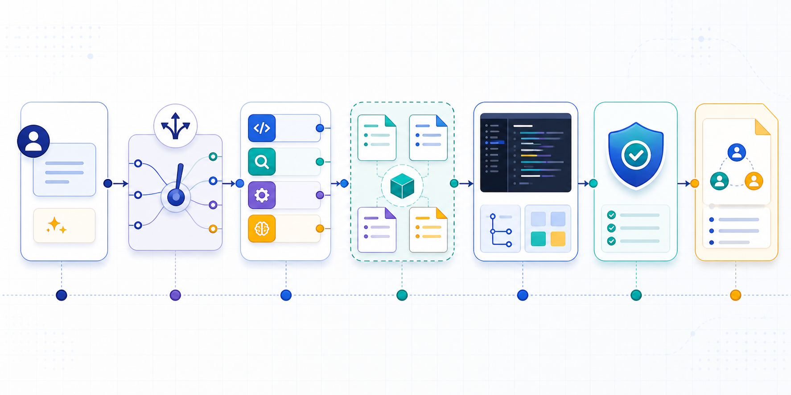
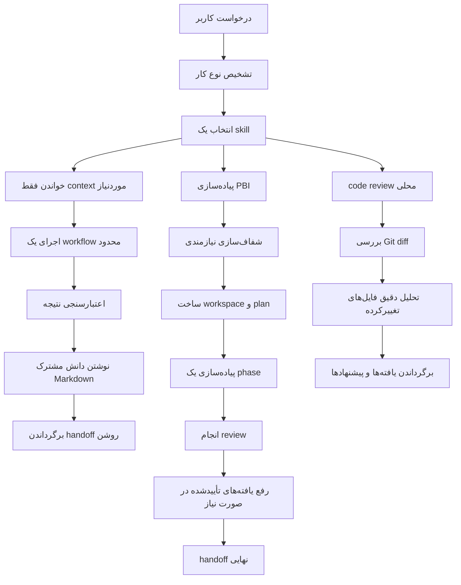

# AI Workflow Coding

## یک سیستم‌عامل ساده برای توسعهٔ نرم‌افزار قابل‌اعتماد با کمک هوش مصنوعی



AI Workflow Coding یک سیستم‌عامل مبتنی بر Markdown برای کار با agentهای هوش مصنوعی و چندین مدل کدنویسی است.

این پروژه به یک تیم توسعهٔ مبتنی بر هوش مصنوعی کمک می‌کند روش مشترکی برای فهم کار، انتخاب workflow مناسب، حفظ دانش مفید، بررسی تغییرات و پایان دادن به کار با یک handoff روشن داشته باشد.

هدف پروژه این است که تیم‌ها از سرعت توسعه با هوش مصنوعی استفاده کنند، بدون اینکه نظم و اصول مهندسی نرم‌افزار را از دست بدهند.

## نحوهٔ استفاده در codebase خودتان

برای استفاده از این سیستم لازم نیست application جداگانه‌ای نصب کنید یا source code خود را تغییر دهید. برای اضافه کردن آن به یک پروژهٔ موجود:

1. پوشهٔ `docs/` را در root repository مربوط به source code خود کپی کنید.
2. فایل‌های `AGENTS.md` و `CLAUDE.md` را نیز در همان root کپی کنید. فایل‌هایی را نگه دارید که با agentها و ابزارهای مورد استفادهٔ شما سازگار هستند.
3. گفت‌وگوی معمول خود را با coding agent شروع کنید. سیستم بر اساس نوع task تشخیص می‌دهد و درخواست را به skill مناسب routing می‌کند.
4. می‌توانید skill را مستقیماً با نام آن نیز فراخوانی کنید؛ برای مثال `pbi_plan_create` یا `pr_review_workflow`.
5. برای promptهای آماده از مسیر [`docs/ai/reference/prompts/`](docs/ai/reference/prompts/) استفاده کنید. اگر تیم شما convention جداگانه‌ای ترجیح می‌دهد، می‌توانید این promptها را در مسیر `resources/prompts/` نیز mirror یا copy کنید.

پیکربندی فعال در مسیر [`docs/ai/config/runtime-config.yaml`](docs/ai/config/runtime-config.yaml) قرار دارد. می‌توانید این فایل را مطابق نیاز خود برای context، هزینه، خروجی terminal و observability سفارشی‌سازی کنید. نمونه‌های `low_cost`، `balanced` و `deep_review` نیز در کنار آن قرار دارند.

## چرا این پروژه ساخته شده است؟

agentهای هوش مصنوعی قدرتمند هستند، اما یک گفت‌وگوی آزاد خیلی سریع می‌تواند دشوار و غیرقابل‌کنترل شود. مشکلات رایج عبارت‌اند از:

- شروع پیاده‌سازی قبل از اینکه نیازمندی واقعاً روشن شده باشد.
- دادن context بیش‌ازحد به agent و افزایش هزینه و سردرگمی.
- از بین رفتن تصمیم‌ها هنگام انتقال کار از یک agent یا مدل به agent یا مدل دیگر.
- مخلوط شدن برنامه‌ریزی، کدنویسی، review و رفع اشکال در یک گفت‌وگوی کنترل‌نشده.
- تغییر تصادفی source code هنگام انجام review.
- تکرار همان دستورها در promptها و فایل‌های مستندات متعدد.
- پایان یافتن کار بدون validation قابل‌اعتماد یا handoff روشن.

AI Workflow Coding این مشکلات را با workflowهای مشخص، skillهای متمرکز، context محدود، workspaceهای مشترک Markdown و قوانین governance برطرف می‌کند.

## این پروژه چه چیزی ارائه می‌دهد؟

این repository یک لایهٔ عملیاتی قابل‌استفادهٔ مجدد برای یک codebase موجود فراهم می‌کند. جایگزین خود application، زبان برنامه‌نویسی، پلتفرم Git یا مدل هوش مصنوعی شما نیست.

در سطح کلی، امکانات زیر را ارائه می‌دهد:

- یک task router که نوع کار را به skill مناسب و تأییدشده متصل می‌کند.
- workspaceهای ساختاریافتهٔ Product Backlog Item (PBI) برای کارهای پیاده‌سازی.
- workflowهای review محلی و مبتنی بر Git diff.
- دانش مشترک Markdown که agentها و مدل‌های مختلف می‌توانند آن را بخوانند.
- governance برای اندازهٔ context، مالکیت مستندات، ایمنی و سازگاری.
- presetهای پیکربندی runtime برای کار کم‌هزینه، متعادل یا review عمیق‌تر.
- راهنماهای مرجع و promptهای آماده برای کاربران حرفه‌ای و maintainerها.
- metricهای سبک برای اجرای workflow، بدون token tracking دقیق یا telemetry خارجی.

## ایدهٔ اصلی

هر درخواست از یک قرارداد کوچک و قابل‌پیش‌بینی پیروی می‌کند:

```text
یک درخواست
    -> یک skill انتخاب‌شده
    -> یک workflow محدود
    -> یک خروجی روشن
```

به‌جای اینکه از agent بخواهیم «همه‌چیز را بخواند و خودش بفهمد»، کاربر یک skill را انتخاب می‌کند و پارامترهای task را ارائه می‌دهد. skill مشخص می‌کند چه چیزی خوانده، تغییر داده و validate شود و چه گزارشی برگردد.

## تمایز اصلی: هر agent یک ردپای قابل‌استفاده باقی می‌گذارد

**این سیستم agentهای متفاوت هوش مصنوعی را به یک تیم مهندسی پیوسته تبدیل می‌کند.** agentهای مختلف مجبور نیستند در هر chat کار را از صفر شروع کنند. برای هر phase یک workspace تخصصی Markdown وجود دارد که agent در آن اطلاعاتی را ثبت می‌کند که agent بعدی واقعاً به آن نیاز دارد:

- تصمیم‌ها و دلیل پشت آن‌ها.
- کشف‌های مهم و سؤال‌های حل‌نشده.
- نتایج validation، یافته‌ها و log عملکرد.
- فایل‌های تغییرکرده، فایل‌هایی که عمداً تغییر نکرده‌اند و اقدام بعدی.
- خلاصه‌ای کوتاه، امن و قابل‌استفاده از فرایند استدلال؛ نه خروجی زنجیرهٔ خصوصی و پنهان فکر مدل.

agent بعدی می‌تواند فایل phase مرتبط را بخواند، وضعیت فعلی را بفهمد، implementation را ادامه دهد، نتیجه را review کند یا از طریق artifactهای مشترک Markdown با agent دیگر گفتگو و هماهنگ شود. **با تغییر مدل یا agent، گفتگو از بین نمی‌رود؛ بلکه به حافظهٔ پروژه تبدیل می‌شود.**

### repo-context: codebase را یک‌بار بشناسید و همه‌جا استفاده کنید

بخش `docs/ai/repo-context/` یکی از قدرتمندترین قابلیت‌های این سیستم است. دانش پایدار مانند architecture، مسئولیت moduleها، file indexها، coding standardها، conventionهای نام‌گذاری، test strategy و policyهای repository می‌تواند یک‌بار مستند شود و در taskهای مختلف مورد استفاده قرار گیرد.

agentها فقط repo-context مرتبط را در زمان نیاز می‌خوانند. لازم نیست در هر task کل codebase را دوباره scan کنند. کشف‌ها و اطلاعات مخصوص همان task سپس در مسیر `docs/ai/pbi/STP-XXXX/` یا workspace مربوط به review ثبت می‌شوند.

**این جداسازی، دانش قابل‌استفادهٔ مجدد را از context موقت task جدا می‌کند. نتیجه، خواندن تکراری کمتر، کاهش context و token cost، handoff سریع‌تر و تصمیم‌های سازگارتر است.**

### PBI workspace: حافظهٔ ماندگار برای تحویل کار

هر PBI می‌تواند workspace ساختاریافتهٔ خودش را برای نیازمندی تأییدشده، context، plan، decision log، phaseهای implementation، validation، metricها و handoff نهایی داشته باشد.

**یک agent جدید می‌تواند با خواندن workspace وارد task فعال شود، بدون اینکه مجبور باشد کل تاریخچه را از روی chat بازسازی کند.** این قابلیت کار چند-agent را عملی، قابل‌بررسی و در صورت تغییر مدل یا پایان session قابل‌بازیابی می‌کند.

### قوانین سراسری تیم: یک‌بار تعریف کنید

coding conventionها، استانداردهای نام‌گذاری، قوانین ایمنی، policyهای review و قواعد governance تیم می‌توانند در فایل‌های canonical مربوط به policy یا governance قرار بگیرند.

**هر قانون را یک‌بار تعریف کنید، آن را همراه repository version کنید و اجازه دهید chatهای آینده به‌صورت خودکار از آن پیروی کنند.** دیگر لازم نیست همان استانداردها را در ابتدای هر گفت‌وگوی جدید تکرار کنید.

## جریان کار در سیستم



## workflowهای اصلی

### workflow پیاده‌سازی PBI

وقتی لازم است یک نیازمندی به‌صورت کنترل‌شده به implementation تبدیل شود، از workflow مربوط به PBI استفاده کنید:

```text
pbi_clarification
-> pbi_workspace_create
-> pbi_plan_create
-> pbi_implementation_phase
-> pbi_review_phase
-> pbi_fix_phase (در صورت نیاز)
-> pbi_final_handoff
```

هر PBI workspace می‌تواند نیازمندی تأییدشده، context، plan، تصمیم‌ها، validation، phaseها و handoff نهایی را در مسیر `docs/ai/pbi/STP-XXXX/` حفظ کند.

### workflow review محلی

برای بررسی یک تغییر محلی از `pr_review_workflow` یا یکی از skillهای متمرکز `review_*` استفاده کنید.

Reviewها عمداً محلی و مبتنی بر diff هستند. taskهای review-only:

- Git diff مرتبط و فایل‌های دقیقاً تغییرکرده را می‌خوانند.
- یافته‌ها، commentها یا پیشنهادها را تولید می‌کنند.
- source code را تغییر نمی‌دهند.
- به PR APIها دسترسی نمی‌گیرند، pull request نمی‌سازند و commit push نمی‌کنند.

Review workspaceها در مسیر `docs/ai/reviews/STP-XXXX/` قرار دارند.

### نگهداری سیستم‌عامل هوش مصنوعی

workflowهای اختصاصی ابزارها، خود سیستم‌عامل را نگهداری می‌کنند:

- `tools_reference_update` راهنماهای کاربر و templateهای prompt را به‌روزرسانی می‌کند.
- `tools_repo_context_update` دانش قابل‌استفادهٔ مجدد repository را به‌روزرسانی می‌کند.
- `tools_policy_plan_update` قوانین تأییدشدهٔ governance یا policy را به‌روزرسانی می‌کند.
- `tools_system_health_check` سلامت و سازگاری AI OS را بررسی می‌کند.
- `tools_docs_ai_cleanup_audit` تکرارهای مستندات و فرصت‌های پاک‌سازی را پیدا می‌کند.

## چه چیزی این پروژه را متمایز می‌کند؟

### Markdown به‌عنوان حافظهٔ مشترک

agentها stateful نیستند. به همین دلیل context مهم در فایل‌های معمولی Markdown نوشته می‌شود؛ فایل‌هایی که می‌توان آن‌ها را بررسی، version و توسط agent دیگری ادامه داد.

این کار workflow را بین مدل‌ها و ابزارهای مختلف قابل‌انتقال می‌کند و حافظهٔ پروژه را به یک جلسهٔ chat خاص وابسته نمی‌سازد.

### skillها، روش‌های اجرایی قابل‌استفاده هستند

یک skill، پروتکلی متمرکز است که پارامترها، محدودهٔ خواندن، مراحل اجرا، قوانین update، شرایط توقف و خروجی موردانتظار را مشخص می‌کند.

skill index کار را به پروتکل درست هدایت می‌کند. بنابراین agent لازم نیست برای هر task یک فرایند جدید از خودش بسازد.

### context عمداً محدود است

runtime پیش‌فرض رویکردی محافظه‌کارانه دارد:

- خواندن skillهای انتخاب‌شده به‌جای همهٔ skillها.
- خواندن repo context فقط هنگام نیاز.
- خواندن فایل‌های دقیق source به‌جای scan کردن کل codebase.
- ترجیح summaryها و workspaceهای موجود.
- گسترش context فقط با دلیل روشن.

این روش تمرکز را بهتر می‌کند، مصرف غیرضروری token را کاهش می‌دهد و احتمال concept drift را پایین می‌آورد.

### governance با مالکیت روشن

قوانین در محل‌های canonical نگهداری می‌شوند و سایر فایل‌ها به آن‌ها reference می‌دهند. دستورهای runtime، skillها، governance، policyهای repository، workspaceها و راهنماهای مرجع مسئولیت‌های جداگانه دارند.

این جداسازی تکرار قوانین را کم می‌کند و بررسی تغییرات را آسان‌تر می‌سازد.

### جداسازی review از implementation

skillهای implementation در صورتی که task اجازه دهد می‌توانند source code را تغییر دهند. skillهای review فقط تحلیل می‌کنند و از local diff استفاده می‌کنند.

این جداسازی review را ایمن‌تر و یافته‌ها را قابل‌اعتمادتر می‌کند.

### مستقل از agent و مدل

این workflow با مدل‌ها و agentهای مختلف قابل‌استفاده است. می‌توان برای شفاف‌سازی، برنامه‌ریزی، implementation، review یا maintenance مدل را تغییر داد، اما قرارداد عملیاتی ثابت می‌ماند.

## ساختار repository

```text
docs/ai/
├── START_HERE.md                 # نقطهٔ ورود runtime
├── skills/                       # پروتکل‌ها و routing تأییدشده
│   ├── pbi/                      # skillهای workflow پیاده‌سازی
│   ├── review/                   # skillهای متمرکز review
│   ├── pr/                       # workflow روزانهٔ review محلی PR
│   ├── tools/                    # skillهای نگهداری و health check
│   └── governance/               # قوانین و قراردادهای مشترک
├── pbi/                          # workspaceها و metricهای PBI
├── reviews/                      # workspaceها و metricهای review
├── repo-context/                 # دانش و policyهای قابل‌استفادهٔ مجدد repository
├── config/                       # تنظیمات و presetهای runtime
└── reference/                    # راهنماها، promptها، validation و history
```

## شروع سریع

1. این سیستم‌عامل را در repositoryای قرار دهید که می‌خواهید در آن توسعهٔ نرم‌افزار با کمک هوش مصنوعی انجام شود.
2. از [`docs/ai/START_HERE.md`](docs/ai/START_HERE.md) شروع کنید.
3. فایل [`docs/ai/skills/README.md`](docs/ai/skills/README.md) را باز کنید و یک skill انتخاب کنید.
4. skill را با پارامترهای صریح و یک task مشخص اجرا کنید.
5. فقط workspace و فایل‌های source موردنیاز همان skill را بخوانید.
6. خروجی را بررسی کنید و سپس به مرحلهٔ بعدی workflow بروید.

مثال:

```text
Use skill: pbi_plan_create

Parameters:
PBI_ID:
STP-1234
PLANNING_DEPTH:
light

Task:
Create an implementation plan for this PBI. Do not modify source code.
```

برای راهنمای کاربران، [Professional End User Guide](docs/ai/reference/guides/professional-end-user-guide.en.md) را ببینید.

برای maintainerها و AI engineerها، [Developer and AI Engineer Guide](docs/ai/reference/guides/ai-engineer/developer-ai-engineer-guide.md) را مطالعه کنید.

## پیکربندی runtime

پیکربندی فعال در [`docs/ai/config/runtime-config.yaml`](docs/ai/config/runtime-config.yaml) قرار دارد.

این فایل مواردی مانند زیر را کنترل می‌کند:

- رفتار محافظه‌کارانه، متعادل یا عمیق‌تر در مدیریت context.
- خارج بودن مستندات مرجع از مسیر معمول runtime.
- خلاصه‌سازی خروجی terminal.
- metricهای محلی و مرکزی اختیاری.

نمونهٔ presetها برای [`low_cost`](docs/ai/config/runtime-config.low_cost.yaml)، [`balanced`](docs/ai/config/runtime-config.balanced.yaml) و [`deep_review`](docs/ai/config/runtime-config.deep_review.yaml) در دسترس هستند.

پیکربندی runtime جایگزین مجوزهای workflow، guardrailهای review یا مالکیت governance نمی‌شود.

## محدوده و محدودیت‌های فعلی

این پروژه یک سیستم‌عامل برای workflowهای مهندسی نرم‌افزار با کمک هوش مصنوعی است. در وضعیت فعلی، یک سیستم مبتنی بر Markdown است و یک سرویس مستقل برای اجرای taskها نیست.

این پروژه به‌صورت خودکار درست بودن code را تضمین نمی‌کند، hallucination را به‌طور کامل حذف نمی‌کند و به‌تنهایی کاهش هزینه یا افزایش reliability را اثبات نمی‌کند. ساختار آن کمک می‌کند این نتایج از طریق workflowهای منظم، validation و ارزیابی‌های آیندهٔ golden task قابل‌دستیابی‌تر و قابل‌اندازه‌گیری‌تر شوند.

سیستم عمداً از token tracking دقیق، telemetry خارجی، dashboardهای real-time، بهینه‌سازی خودکار و ادعاهای تأییدنشده دربارهٔ کیفیت مدل‌ها استفاده نمی‌کند.

## این پروژه برای چه کسانی مناسب است؟

- توسعه‌دهندگانی که برای کار واقعی پروژه از AI coding agent استفاده می‌کنند.
- Tech Leadهایی که می‌خواهند فرایندهای تکرارپذیر توسعهٔ نرم‌افزار با AI بسازند.
- تیم‌هایی که بین مدل‌ها یا agentهای مختلف جابه‌جا می‌شوند.
- Maintainerهایی که در حال ساخت یک playbook داخلی برای AI engineering هستند.
- Reviewerهایی که به یک فرایند review امن، محلی و diff-first نیاز دارند.

## نقشهٔ مستندات

- [نقطهٔ ورود runtime](docs/ai/START_HERE.md)
- [Skill index](docs/ai/skills/README.md)
- [PBI workflow](docs/ai/pbi/README.md)
- [Review workflow](docs/ai/reviews/README.md)
- [پیکربندی runtime](docs/ai/config/README.md)
- [راهنماها و promptهای مرجع](docs/ai/reference/README.md)
- [راهنمای Developer و AI Engineer](docs/ai/reference/guides/ai-engineer/developer-ai-engineer-guide.md)

## مجوز

در حال حاضر فایل license در این repository وجود ندارد. پیش از انتشار عمومی یا استفادهٔ مجدد، یک license مشخص به پروژه اضافه کنید.
