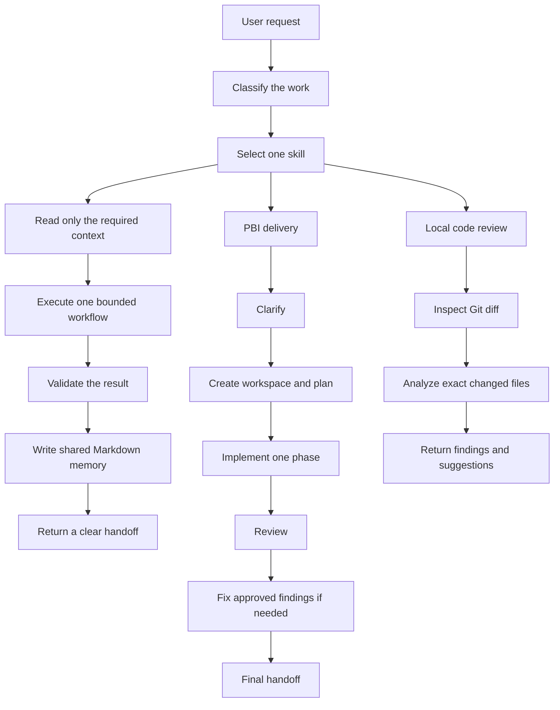

# AI Workflow Coding

## A simple operating system for reliable AI-assisted software development


AI Workflow Coding is a Markdown-first operating system for working with AI agents and multiple coding models.

It gives an AI coding team a shared way to understand work, choose the right workflow, keep useful memory, review changes, and finish with a clear handoff.

The project is designed for teams that want the speed of AI coding without losing engineering discipline.

## How to use it in your own codebase

You do not need to install a separate application or change your source code. To add this system to an existing project:

1. Copy the `docs/` directory into the root of your source-code repository.
2. Copy `AGENTS.md` and `CLAUDE.md` into the same repository root. Keep the files that match the agents and tools you use.
3. Start your normal conversation with your coding agent. The system routes the request to the appropriate skill based on the task.
4. You can also invoke a skill directly by name, for example `pbi_plan_create` or `pr_review_workflow`.
5. For ready-to-use prompts, use [`docs/ai/reference/prompts/`](docs/ai/reference/prompts/). If your team prefers a separate convention, you can also mirror or copy these prompts into `resources/prompts/`.

The active configuration is [`docs/ai/config/runtime-config.yaml`](docs/ai/config/runtime-config.yaml). Customize this file to match your context, cost, terminal-output, and observability preferences. Preset examples are available beside it for `low_cost`, `balanced`, and `deep_review` usage.

## Why this project exists

AI agents are powerful, but a free-form conversation can quickly become difficult to control. Common problems include:

- Starting implementation before the requirement is clear.
- Giving an agent too much repository context and increasing cost and confusion.
- Losing decisions when a task moves from one agent or model to another.
- Mixing planning, coding, review, and fixing in one uncontrolled conversation.
- Letting a review modify source code by accident.
- Repeating the same instructions in many prompts and documentation files.
- Ending a task without a reliable validation record or handoff.

AI Workflow Coding addresses these problems with explicit workflows, focused skills, bounded context, shared Markdown workspaces, and governance rules.

## What you get

The repository provides a reusable operating layer around an existing codebase. It does not replace your application, programming language, Git provider, or AI model.

At a high level, it provides:

- A task router that maps the type of work to one approved skill.
- Structured Product Backlog Item (PBI) workspaces for implementation tasks.
- Local Git-diff-driven review workflows.
- Shared Markdown memory that can be read by different agents and models.
- Governance for context size, documentation ownership, safety, and compatibility.
- Runtime configuration presets for low-cost, balanced, or deeper review work.
- Reference guides and ready-to-use prompts for professional users and maintainers.
- Lightweight execution metrics without exact token tracking or external telemetry.

## The core idea

Every request follows a small, predictable contract:

```text
One request
    -> one selected skill
    -> one bounded workflow
    -> one clear output
```

Instead of asking an agent to “read everything and figure it out,” the user selects a skill and supplies the task parameters. The skill defines what to read, what to change, what to validate, and what to report.

## The defining advantage: every agent leaves a usable trail

**This system turns separate AI agents into a continuous engineering team.** Different agents do not have to start from zero in every chat. Each phase has a dedicated Markdown workspace where the agent records the work that the next agent actually needs:

- Decisions and the reasons behind them.
- Important discoveries and unresolved questions.
- Validation results, findings, and performance logs.
- Files changed, files intentionally not changed, and the next action.
- A concise reasoning summary that is safe and useful to share — not a dump of private hidden chain-of-thought.

The next agent can read the relevant phase file, understand the current state, continue the implementation, review the result, or communicate with another agent through shared Markdown artifacts. **The conversation does not disappear when the model or agent changes; it becomes project memory.**

### Repository context: learn the codebase once, reuse it everywhere

The `docs/ai/repo-context/` area is one of the system's strongest capabilities. Stable knowledge such as architecture, module responsibilities, file indexes, coding standards, naming conventions, test strategy, and repository policies can be documented once and reused across tasks.

Agents read only the relevant repository context when they need it. They do not repeatedly scan the whole codebase. Task-specific discoveries then go into `docs/ai/pbi/STP-XXXX/` or the relevant review workspace.

**This separates reusable knowledge from temporary task context. The result is less repeated reading, lower context and token cost, faster handoffs, and more consistent decisions.**

### PBI workspaces: a durable memory for delivery

Every PBI can have its own structured workspace for the approved requirement, context, plan, decision log, implementation phases, validation, metrics, and final handoff.

**A new agent can join an active task by reading the workspace instead of reconstructing the entire history from chat.** This makes multi-agent delivery practical, inspectable, and easier to recover when a model changes or a session ends.

### Global team rules: define them once

Team-wide coding conventions, naming standards, safety rules, review policies, and governance can live in the appropriate canonical policy or governance files.

**Define a rule once, keep it versioned with the repository, and let future chats follow it automatically.** You do not need to repeat the same standards at the start of every new conversation.

## How work flows through the system



## Main workflows

### PBI implementation workflow

Use the PBI workflow when a requirement needs to become a controlled implementation:

```text
pbi_clarification
-> pbi_workspace_create
-> pbi_plan_create
-> pbi_implementation_phase
-> pbi_review_phase
-> pbi_fix_phase (when needed)
-> pbi_final_handoff
```

Each PBI workspace can preserve the approved requirement, context, plan, decisions, validation, phases, and final handoff under `docs/ai/pbi/STP-XXXX/`.

### Local review workflow

Use `pr_review_workflow` or a focused `review_*` skill to review a local change.

Reviews are intentionally local-diff driven. Review-only work:

- Reads the relevant Git diff and exact changed files.
- Produces findings, comments, or suggestions.
- Does not modify source code.
- Does not call PR APIs, create pull requests, or push commits.

Review workspaces live under `docs/ai/reviews/STP-XXXX/`.

### AI operating system maintenance

Dedicated tool workflows maintain the operating system itself:

- `tools_reference_update` updates user-facing guides and prompt templates.
- `tools_repo_context_update` updates reusable repository knowledge.
- `tools_policy_plan_update` updates approved governance or policy rules.
- `tools_system_health_check` checks the health and consistency of the AI OS.
- `tools_docs_ai_cleanup_audit` identifies documentation duplication and cleanup opportunities.

## What makes it different

### Markdown is shared memory

Agents are stateless. Important context is therefore written to ordinary Markdown files that can be inspected, reviewed, versioned, and continued by another agent.

This makes the workflow portable across models and tools instead of tying project memory to one chat session.

### Skills are executable operating procedures

A skill is a focused protocol with parameters, read scope, steps, update rules, stop conditions, and an expected final output.

The skill index routes work to the right protocol. This reduces the chance that an agent invents its own process for every task.

### Context is deliberately bounded

The default runtime is conservative:

- Read selected skills instead of all skills.
- Read repository context only when it is needed.
- Read exact source files instead of scanning the whole codebase.
- Prefer existing summaries and workspaces.
- Expand context only when there is a clear reason.

This improves focus, reduces unnecessary token usage, and lowers the risk of concept drift.

### Governance has clear ownership

Rules are kept in canonical locations and referenced from other documents. Runtime instructions, skills, governance, repository policy, workspaces, and reference guides have separate responsibilities.

This reduces duplicated rules and makes changes easier to review.

### Review is separated from implementation

Implementation skills may change source code when the task allows it. Review skills are analysis-only and work from the local diff.

Keeping these responsibilities separate makes review safer and makes findings easier to trust.

### Agent-neutral by design

The workflow can be used with different models or agents. The model may change for clarification, planning, implementation, review, or maintenance, but the operating contract remains stable.

## Repository structure

```text
docs/ai/
├── START_HERE.md                 # Runtime entry point
├── skills/                       # Approved execution protocols and routing
│   ├── pbi/                      # Implementation workflow skills
│   ├── review/                   # Focused review skills
│   ├── pr/                       # Daily local PR review workflow
│   ├── tools/                    # Maintenance and health skills
│   └── governance/               # Shared rules and contracts
├── pbi/                          # PBI workspaces and metrics
├── reviews/                      # Review workspaces and metrics
├── repo-context/                 # Reusable repository knowledge and policy
├── config/                       # Runtime settings and presets
└── reference/                    # Guides, prompts, validation, and history
```

## Quick start

1. Add this operating system to the repository where you want to use AI-assisted development.
2. Start at [`docs/ai/START_HERE.md`](docs/ai/START_HERE.md).
3. Open [`docs/ai/skills/README.md`](docs/ai/skills/README.md) and select one skill.
4. Run the skill with explicit parameters and one concrete task.
5. Read only the workspace and source files required by that skill.
6. Check the output before starting the next workflow step.

Example:

```text
Use skill: pbi_plan_create

Parameters:
PBI_ID:
STP-1234
PLANNING_DEPTH:
light

Task:
Create an implementation plan for this PBI. Do not modify source code.
```

For user-oriented instructions, see the [Professional End User Guide](docs/ai/reference/guides/professional-end-user-guide.en.md).

For maintainers and AI engineers, see the [Developer and AI Engineer Guide](docs/ai/reference/guides/ai-engineer/developer-ai-engineer-guide.md).

## Runtime configuration

The active configuration is [`docs/ai/config/runtime-config.yaml`](docs/ai/config/runtime-config.yaml).

It controls preferences such as:

- Conservative, balanced, or deeper context behavior.
- Whether reference documentation is outside the normal runtime path.
- Terminal output summarization.
- Optional local and central metrics.

Preset examples are available for [`low_cost`](docs/ai/config/runtime-config.low_cost.yaml), [`balanced`](docs/ai/config/runtime-config.balanced.yaml), and [`deep_review`](docs/ai/config/runtime-config.deep_review.yaml).

Runtime configuration does not override workflow permissions, review guardrails, or governance ownership.

## Scope and current boundaries

This project is an operating system for AI-assisted engineering workflows. It is currently a Markdown-based system, not a standalone execution service.

It does not claim to automatically guarantee correct code, eliminate hallucinations, or prove lower cost and higher reliability by itself. The structure is designed to make those outcomes easier to pursue and measure through disciplined workflows, validation, and future golden-task evaluation.

The system also intentionally avoids exact token tracking, external telemetry, real-time dashboards, autonomous optimization, and unsupported claims about model quality.

## Who should use it?

- Developers who use AI coding agents for real project work.
- Tech leads who want repeatable AI-assisted delivery practices.
- Teams that switch between models or agents.
- Maintainers building an internal AI engineering playbook.
- Reviewers who need a safe, local, diff-first review process.

## Documentation map

- [Runtime entry point](docs/ai/START_HERE.md)
- [Skill index](docs/ai/skills/README.md)
- [PBI workflow](docs/ai/pbi/README.md)
- [Review workflow](docs/ai/reviews/README.md)
- [Runtime configuration](docs/ai/config/README.md)
- [Reference guides and prompts](docs/ai/reference/README.md)
- [Developer and AI engineer guide](docs/ai/reference/guides/ai-engineer/developer-ai-engineer-guide.md)

## License

No license file is currently included in this repository. Add an explicit license before distributing or reusing it publicly.
