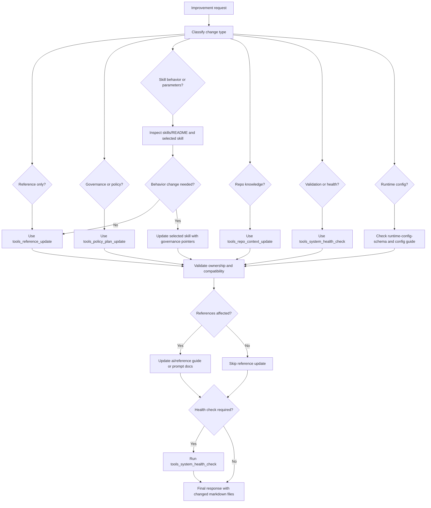

# Developer and AI Engineer Flow

## Purpose

Use this flow when maintaining, improving, or extending the V2.3 AI Operating System.

This is not a runtime workflow for ordinary PBI or review work. It is a maintenance and improvement workflow.

## Flow Diagram

## Decision Flow

| Question | If Yes | Main Skill |
|---|---|---|
| Is this only user-facing guide or prompt documentation? | Update `docs/ai/reference/` only. | `tools_reference_update` |
| Does this change governance or policy? | Update canonical governance or policy only. | `tools_policy_plan_update` |
| Does this update reusable repo knowledge? | Update repo-context through its owner. | `tools_repo_context_update` |
| Does this validate the whole AI OS? | Write latest and history health reports. | `tools_system_health_check` |
| Does this audit docs cleanup or duplication? | Produce cleanup audit or plan. | `tools_docs_ai_cleanup_audit` |
| Does this alter skill behavior? | Update only the selected skill and related references. | Selected maintenance task, then health check |

## Safe Execution Pattern

1. Classify the requested change.
2. Select one approved skill.
3. Read only the minimum canonical files.
4. Make the smallest scoped update.
5. Preserve backward compatibility.
6. Update reference docs only if user-facing usage changed.
7. Validate links, routing, and ownership.
8. Run system health check when required.
9. Report changed markdown files.

## Stop Conditions

Stop and ask for clarification when:

- The requested change would introduce V3 concepts.
- The requested change would remove compatibility mappings.
- The requested change would blur runtime, reference, repo-context, and workspace ownership.
- The requested change requires source code modification but the selected maintenance skill does not allow it.
- Required skill metadata is missing and cannot be represented safely.
