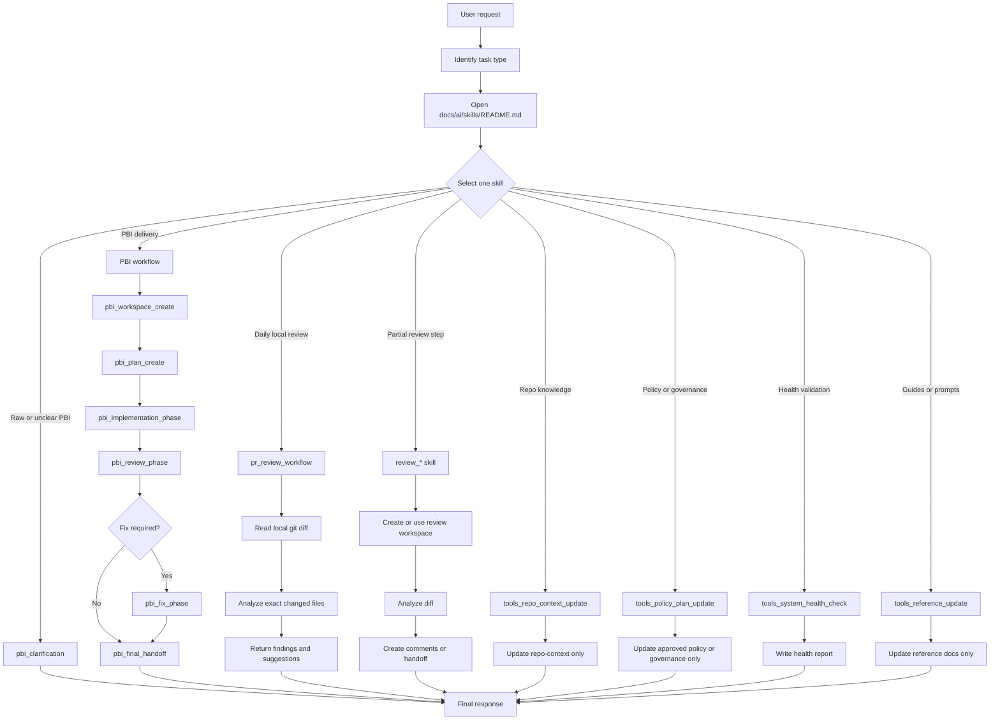

# Professional End User Guide

## Purpose
This guide is for a developer who wants to use the V2.3 AI Operating System professionally across multiple models and agents while keeping the process simple, efficient, low-cost, and controlled.

This guide explains:

- Where to start.
- Which skill to choose.
- Which parameters to prepare.
- What to give the agent and what to avoid.
- When to use PBI, review, PR review, tools, reference material, or health checks.
- How to split work across multiple models or agents without breaking the workflow.

## Core Mental Model
This system is not free-form prompting. It is skill-driven.

Every execution should follow this shape:

```text
Use skill: skill_name
Parameters:
PARAMETER:
value
Task:
Concrete task for this run.
```

Core rule:

```text
One request -> one selected skill -> one bounded workflow -> one clear output
```

## Runtime Path
During normal execution, the agent should read only this path:

```text
AGENTS.md or CLAUDE.md
-> docs/ai/START_HERE.md
-> docs/ai/skills/README.md
-> selected skill only
-> active workspace only if needed
-> repo-context only if needed
-> exact source files only if needed
```

`docs/ai/reference/**` is for guides, ready prompts, validation, history, decisions, system health, or AI OS maintenance. It is not part of the default runtime path.

## Workflow Diagram



## Step 1 - Classify The Request
Before writing a prompt, classify the work.

| User Goal | Use This Area | Best Starting Skill |
|---|---|---|
| You have a raw or unclear PBI | PBI | `pbi_clarification` |
| You want to create a PBI workspace | PBI | `pbi_workspace_create` |
| You want a structured implementation plan | PBI | `pbi_plan_create` |
| You want to execute one phase | PBI | `pbi_implementation_phase` |
| You want to review an implementation | PBI | `pbi_review_phase` |
| You want to fix approved findings | PBI | `pbi_fix_phase` |
| You want to review a local branch | PR | `pr_review_workflow` |
| You want to run one review step only | Review | `review_*` skill |
| You want to update repo-context | Tools | `tools_repo_context_update` |
| You want to update policy or governance | Tools | `tools_policy_plan_update` |
| You want to validate system health | Tools | `tools_system_health_check` |
| You want to create or update guides or prompt templates | Tools | `tools_reference_update` |

## Step 2 - Choose The Right Agent Or Model
You can use multiple models or agents, but each one must follow the same operating rules.

| Work Type | Recommended Agent / Model Style | Reason |
|---|---|---|
| PBI clarification | Precise conversational model | Asks useful questions and reduces ambiguity. |
| Planning | Strong reasoning model | Breaks work into phases and identifies risks. |
| Implementation | Coding agent with workspace access | Makes bounded, verifiable changes. |
| Review | Strict and detail-oriented model | Finds bugs, regressions, missing tests, and risks. |
| Policy / governance | Conservative documentation-focused model | Records behavior without breaking compatibility. |
| Health check | Audit-focused model | Checks cohesion, duplication, and broken references. |

Important rule: change the model if useful, but do not change the workflow.

## Step 3 - Prepare The Prompt
A good prompt has three parts:

```text
Use skill: skill_name
Parameters:
PARAMETER_1:
value
PARAMETER_2:
value
Task:
What the agent must do in this run.
```

Example:

```text
Use skill: pbi_plan_create
Parameters:
PBI_ID:
STP-1234
PLANNING_DEPTH:
light
Task:
Create a concise implementation plan for this PBI. Do not modify source code.
```

## Step 4 - Keep Context Small
Do not ask the agent to read the whole repository or all of `docs/ai`.

Better:

```text
Use the selected skill and read only files required by that skill.
```

Worse:

```text
Read the whole repository and all docs before starting.
```

For professional use, smaller context means:

- Faster output.
- Lower hallucination risk.
- More precise decisions.
- Lower cost.
- Lower chance of touching the wrong files.

## Step 5 - Run One Skill At A Time
Run only one skill per request.

If a workflow has multiple steps, run each step separately.

PBI example:

```text
Run pbi_workspace_create.
Check output.
Run pbi_plan_create.
Check plan.
Run pbi_implementation_phase for one phase.
Run pbi_review_phase.
Run pbi_fix_phase only if needed.
Run pbi_final_handoff.
```

## Step 6 - Use Workspaces As Memory
Markdown files are shared memory.

| Memory Type | Location | Purpose |
|---|---|---|
| PBI workspace | `docs/ai/pbi/STP-XXXX/` | planning, phases, validation, handoff |
| Review workspace | `docs/ai/reviews/STP-XXXX/` | diff analysis, comments, suggestions |
| repo-context | `docs/ai/repo-context/` | reusable repository knowledge |
| Reference | `docs/ai/reference/` | guides, prompts, validation material |

Agents are stateless. If work must continue across multiple agents, the output should be recorded in the relevant markdown workspace.

## Step 7 - Professional Multi-Agent Pattern
Keep roles separate when using multiple agents.

| Role | Best Skill Area | Output |
|---|---|---|
| Clarifier | PBI | approved PBI or clarification questions |
| Planner | PBI | implementation plan |
| Implementer | PBI | source changes allowed only by implementation skill |
| Reviewer | PR / Review | findings, comments, suggestions |
| Fixer | PBI | fixes for approved findings |
| Maintainer | Tools | repo-context, policy, reference, health reports |

Rule: two agents should not update the same workspace file at the same time without coordination.

## Step 8 - Review Workflow Rules
For review:

- Use `pr_review_workflow` for daily local review.
- Review must be local-git-diff driven.
- Review-only tasks must not modify source code.
- Review must not call PR APIs.
- Review must not create pull requests.
- Review must not push commits.

Example:

```text
Use skill: pr_review_workflow
Parameters:
STP_ID:
STP-1234
BASE_BRANCH:
main
REVIEW_MODE:
normal
Task:
Review the local git diff and return findings only. Do not modify source code.
```

## Step 9 - PBI Workflow Rules
For full delivery, use the PBI workflow.

Recommended order:

```text
pbi_clarification
-> pbi_workspace_create
-> pbi_plan_create
-> pbi_implementation_phase
-> pbi_review_phase
-> pbi_fix_phase if needed
-> pbi_final_handoff
```

Complete one phase before moving to the next phase.

## Step 10 - Tools Workflow Rules
Use tools only for maintenance.

| Need | Skill |
|---|---|
| repo knowledge update | `tools_repo_context_update` |
| policy update | `tools_policy_plan_update` |
| docs/reference update | `tools_reference_update` |
| docs cleanup audit | `tools_docs_ai_cleanup_audit` |
| full system validation | `tools_system_health_check` |

After structural changes to docs, skills, governance, policy, reference, or workflow, run a health check.

## Step 11 - Use Ready Prompts
For quick execution, copy ready prompts from these folders:

| Area | Prompt Folder |
|---|---|
| PBI | `docs/ai/reference/prompts/pbi/` |
| PR review | `docs/ai/reference/prompts/pr/` |
| Review steps | `docs/ai/reference/prompts/review/` |
| Tools | `docs/ai/reference/prompts/tools/` |
| System health | `docs/ai/reference/prompts/system-health-prompts/` |

Change only parameter values, then run the prompt.

## Step 12 - Choose Runtime Config Profile

The active runtime config is:

```text
docs/ai/config/runtime-config.yaml
```

Agents may read this file after `docs/ai/skills/README.md` only to apply runtime preferences. It does not change skill routing, workflow behavior, source-code permissions, review guardrails, repo-context ownership, markdown shared memory, or the reference boundary.

Runtime config now controls four areas:

| Area | Purpose |
|---|---|
| `runtime.rtk` | Optional RTK terminal-output optimization. |
| `context.*` | Context cost, repo-context reading, source reading, broad scan, and final response detail preferences. |
| `terminal.output.*` | Terminal output summarization and raw-output behavior. |
| `observability.*` | Workspace metrics, dashboards, final response status, and tool report summaries. |

Preset examples live beside the active config:

| Preset | File | Best For |
|---|---|---|
| `low_cost` | `docs/ai/config/runtime-config.low_cost.yaml` | Routine or cost-sensitive work. |
| `balanced` | `docs/ai/config/runtime-config.balanced.yaml` | Normal professional use. |
| `deep_review` | `docs/ai/config/runtime-config.deep_review.yaml` | Complex review, architecture-sensitive work, or AI OS maintenance. |

Only `runtime-config.yaml` is active. To use a preset, copy that preset's contents into `runtime-config.yaml`.

Professional defaults:

- Use `low_cost` for routine PBI steps, simple review, and fast low-risk work.
- Use `balanced` when you want better review quality without large context expansion.
- Use `deep_review` only when the task genuinely needs broader task-relevant context.
- Keep `context.reference_docs: false` for runtime work.
- Keep `context.broad_scan: false` unless the user explicitly asks for a full audit or maintenance task.
- Keep `exact_token_tracking: false` and `external_telemetry: false`.

Read the dedicated guide for exact settings and examples:

```text
docs/ai/reference/guides/runtime-config-guide.en.md
```

Canonical governance lives in:

```text
docs/ai/skills/governance/runtime-config-schema.md
docs/ai/skills/governance/context-management.md
docs/ai/skills/governance/terminal-output-optimization.md
docs/ai/skills/governance/observability.md
```

## Step 13 - End User Operating Checklist
Before execution:

- Is the goal clear?
- Is the correct skill selected?
- Is only one skill being run?
- Are parameters complete?
- Is the task concrete?
- Is source modification allowed?
- Is the correct workspace selected?
- Is the agent avoiding broad repository reads?

After execution:

- Read the output.
- Review changed markdown files.
- If source changed, run suitable validation.
- If `docs/ai` or governance changed, run a system health check.
- If another step is needed, run the next prompt with the next skill.

## Common Mistakes

| Mistake | Better Approach |
|---|---|
| Running multiple skills in one prompt | Run each skill separately. |
| Asking the agent to read the whole repository | Read only the selected skill and required files. |
| Treating reference docs as runtime authority | Reference docs are only for learning and ready prompts. |
| Combining review with source modification | Review-only work should return findings only. |
| Using old skill names | Use canonical names from `skills/README.md`. |
| Changing workflow through a free-form prompt | Workflow must come from the selected skill. |

## Daily Usage Recipe
For daily use:

1. Write the goal in one sentence.
2. Find the right skill from `docs/ai/reference/help-index.md` or `docs/ai/skills/README.md`.
3. Copy the ready prompt from `docs/ai/reference/prompts/`.
4. Replace parameter values.
5. Run only that prompt.
6. Review the output.
7. If another step is needed, run the next prompt.

## Weekly Maintenance Recipe
Weekly or after important changes:

1. If repo knowledge changed, run `tools_repo_context_update`.
2. If policy or governance changed, run `tools_policy_plan_update`.
3. If reference guides or prompts changed, run `tools_reference_update`.
4. If `docs/ai` structure or skills changed, run `tools_system_health_check`.

## Final Rule
Choose the model and agent freely, but keep the system path stable:

```text
Use skill + Parameters
one skill at a time
minimal context
markdown memory
clear validation
```
