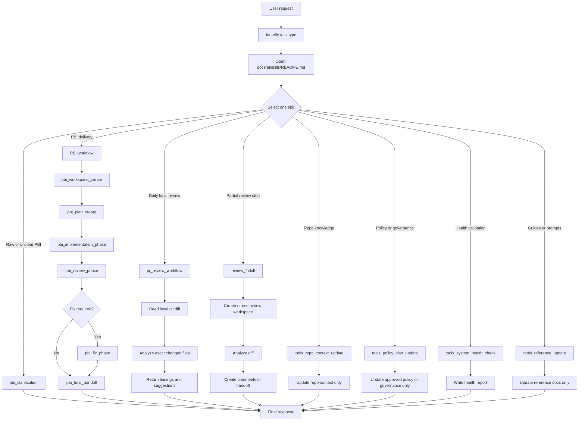

# Professional End User Guide

## Purpose
این راهنما برای برنامه‌نویسی است که می‌خواهد از V2.3 AI Operating System روی چند model و چند agent به‌صورت ساده، حرفه‌ای، کم‌هزینه و قابل کنترل استفاده کند.

هدف این راهنما این است که کاربر بداند:

- از کجا شروع کند.
- چه skillای را انتخاب کند.
- چه parameterهایی را آماده کند.
- چه چیزی را به agent بدهد و چه چیزی را ندهد.
- چه زمانی از PBI، review، PR review، tools، reference، یا health check استفاده کند.
- چطور بین چند model یا agent کار را تقسیم کند بدون اینکه workflow خراب شود.

## Core Mental Model
این سیستم prompt آزاد نیست. این سیستم skill-driven است.

هر اجرا باید این شکل را داشته باشد:

```text
Use skill: skill_name
Parameters:
PARAMETER:
value
Task:
Concrete task for this run.
```

اصل اصلی:

```text
One request -> one selected skill -> one bounded workflow -> one clear output
```

## Runtime Path
در اجرای عادی، agent باید فقط این مسیر را بخواند:

```text
AGENTS.md or CLAUDE.md
-> docs/ai/START_HERE.md
-> docs/ai/skills/README.md
-> selected skill only
-> active workspace only if needed
-> repo-context only if needed
-> exact source files only if needed
```

`docs/ai/reference/**` برای آموزش، prompt آماده، validation، history، decisions، system health، یا AI OS maintenance است. این پوشه runtime پیش‌فرض نیست.

## Workflow Diagram



## Step 1 - Classify The Request
قبل از نوشتن prompt، نوع کار را مشخص کن.

| User Goal | Use This Area | Best Starting Skill |
|---|---|---|
| ایده یا PBI خام داری | PBI | `pbi_clarification` |
| می‌خواهی workspace برای PBI بسازی | PBI | `pbi_workspace_create` |
| می‌خواهی plan ساختارمند بسازی | PBI | `pbi_plan_create` |
| می‌خواهی یک phase را اجرا کنی | PBI | `pbi_implementation_phase` |
| می‌خواهی implementation را review کنی | PBI | `pbi_review_phase` |
| می‌خواهی findings را fix کنی | PBI | `pbi_fix_phase` |
| می‌خواهی local branch را review کنی | PR | `pr_review_workflow` |
| می‌خواهی فقط یک مرحله review را اجرا کنی | Review | `review_*` skill |
| می‌خواهی repo-context را آپدیت کنی | Tools | `tools_repo_context_update` |
| می‌خواهی policy یا governance را آپدیت کنی | Tools | `tools_policy_plan_update` |
| می‌خواهی سلامت سیستم را بررسی کنی | Tools | `tools_system_health_check` |
| می‌خواهی guide یا prompt template بسازی | Tools | `tools_reference_update` |

## Step 2 - Choose The Right Agent Or Model
از چند model یا agent می‌توانی استفاده کنی، اما همه باید همین قوانین را رعایت کنند.

| Work Type | Recommended Agent / Model Style | Reason |
|---|---|---|
| PBI clarification | مدل دقیق و مکالمه‌ای | سوال خوب می‌پرسد و ambiguity را کم می‌کند. |
| Planning | مدل قوی در reasoning | plan را فازبندی و ریسک‌ها را مشخص می‌کند. |
| Implementation | coding agent با دسترسی به workspace | تغییرات محدود و قابل validation انجام می‌دهد. |
| Review | مدل سخت‌گیر و دقیق | bug، regression، missing test و risk را بهتر پیدا می‌کند. |
| Policy / governance | مدل محافظه‌کار و مستندساز | رفتار سیستم را بدون شکستن compatibility ثبت می‌کند. |
| Health check | مدل دقیق در audit | cohesion، duplication و broken references را بررسی می‌کند. |

قانون مهم: model را عوض کن، ولی workflow را عوض نکن.

## Step 3 - Prepare The Prompt
یک prompt خوب سه بخش دارد:

```text
Use skill: skill_name
Parameters:
PARAMETER_1:
value
PARAMETER_2:
value
Task:
What the agent must do in this run.
```

نمونه:

```text
Use skill: pbi_plan_create
Parameters:
PBI_ID:
STP-1234
PLANNING_DEPTH:
light
Task:
Create a concise implementation plan for this PBI. Do not modify source code.
```

## Step 4 - Keep Context Small
به agent نگویید کل repository یا کل `docs/ai` را بخواند.

بهتر:

```text
Use the selected skill and read only files required by that skill.
```

بدتر:

```text
Read the whole repository and all docs before starting.
```

برای کار حرفه‌ای، context کم یعنی:

- خروجی سریع‌تر.
- ریسک کمتر برای hallucination.
- تصمیم‌گیری دقیق‌تر.
- هزینه کمتر.
- احتمال کمتر برای تغییر فایل‌های اشتباه.

## Step 5 - Run One Skill At A Time
هر بار فقط یک skill اجرا کن.

اگر workflow چند مرحله دارد، هر مرحله را جدا اجرا کن.

مثال PBI:

```text
Run pbi_workspace_create.
Check output.
Run pbi_plan_create.
Check plan.
Run pbi_implementation_phase for one phase.
Run pbi_review_phase.
Run pbi_fix_phase only if needed.
Run pbi_final_handoff.
```

## Step 6 - Use Workspaces As Memory
Markdown فایل‌ها shared memory هستند.

| Memory Type | Location | Purpose |
|---|---|---|
| PBI workspace | `docs/ai/pbi/STP-XXXX/` | planning, phases, validation, handoff |
| Review workspace | `docs/ai/reviews/STP-XXXX/` | diff analysis, comments, suggestions |
| repo-context | `docs/ai/repo-context/` | reusable repository knowledge |
| Reference | `docs/ai/reference/` | guides, prompts, validation material |

Agentها stateless هستند. اگر می‌خواهی کار بین چند agent ادامه پیدا کند، خروجی باید در markdown workspace ثبت شود.

## Step 7 - Professional Multi-Agent Pattern
برای چند agent، نقش‌ها را جدا نگه دار.

| Role | Best Skill Area | Output |
|---|---|---|
| Clarifier | PBI | approved PBI or clarification questions |
| Planner | PBI | implementation plan |
| Implementer | PBI | source changes allowed only by implementation skill |
| Reviewer | PR / Review | findings, comments, suggestions |
| Fixer | PBI | fixes for approved findings |
| Maintainer | Tools | repo-context, policy, reference, health reports |

قانون: دو agent هم‌زمان نباید یک فایل workspace را بدون هماهنگی به‌روزرسانی کنند.

## Step 8 - Review Workflow Rules
برای review:

- از `pr_review_workflow` برای daily local review استفاده کن.
- review باید local git diff driven باشد.
- review-only task نباید source code را تغییر دهد.
- review نباید PR API صدا بزند.
- review نباید PR بسازد.
- review نباید push کند.

نمونه:

```text
Use skill: pr_review_workflow
Parameters:
STP_ID:
STP-1234
BASE_BRANCH:
main
REVIEW_MODE:
normal
Task:
Review the local git diff and return findings only. Do not modify source code.
```

## Step 9 - PBI Workflow Rules
برای delivery کامل، از PBI workflow استفاده کن.

ترتیب پیشنهادی:

```text
pbi_clarification
-> pbi_workspace_create
-> pbi_plan_create
-> pbi_implementation_phase
-> pbi_review_phase
-> pbi_fix_phase if needed
-> pbi_final_handoff
```

یک phase را کامل کن، بعد برو سراغ phase بعدی.

## Step 10 - Tools Workflow Rules
از tools فقط برای maintenance استفاده کن.

| Need | Skill |
|---|---|
| repo knowledge update | `tools_repo_context_update` |
| policy update | `tools_policy_plan_update` |
| docs/reference update | `tools_reference_update` |
| docs cleanup audit | `tools_docs_ai_cleanup_audit` |
| full system validation | `tools_system_health_check` |

بعد از تغییرات ساختاری در docs, skills, governance, policy, reference یا workflow، health check اجرا کن.

## Step 11 - Use Ready Prompts
برای اجرای سریع، prompt آماده را از این مسیرها بردار:

| Area | Prompt Folder |
|---|---|
| PBI | `docs/ai/reference/prompts/pbi/` |
| PR review | `docs/ai/reference/prompts/pr/` |
| Review steps | `docs/ai/reference/prompts/review/` |
| Tools | `docs/ai/reference/prompts/tools/` |
| System health | `docs/ai/reference/prompts/system-health-prompts/` |

فقط parameterها را تغییر بده و prompt را اجرا کن.

## Step 12 - انتخاب Runtime Config Profile

فایل فعال runtime config اینجاست:

```text
docs/ai/config/runtime-config.yaml
```

agent می‌تواند این فایل را بعد از `docs/ai/skills/README.md` فقط برای اعمال runtime preferences بخواند. این فایل skill routing، workflow behavior، source-code permissions، review guardrailها، مالکیت repo-context، markdown shared memory یا reference boundary را تغییر نمی‌دهد.

runtime config حالا چهار ناحیه را کنترل می‌کند:

| ناحیه | هدف |
|---|---|
| `runtime.rtk` | بهینه‌سازی اختیاری خروجی terminal با RTK. |
| `context.*` | preferenceهای context cost، خواندن repo-context، خواندن source، broad scan و final response detail. |
| `terminal.output.*` | خلاصه‌سازی خروجی terminal و رفتار raw output. |
| `observability.*` | workspace metrics، dashboardها، final response status و tool report summaries. |

presetهای نمونه کنار config فعال قرار دارند:

| Preset | فایل | مناسب برای |
|---|---|---|
| `low_cost` | `docs/ai/config/runtime-config.low_cost.yaml` | کارهای روزمره یا حساس به هزینه. |
| `balanced` | `docs/ai/config/runtime-config.balanced.yaml` | استفاده حرفه‌ای معمولی. |
| `deep_review` | `docs/ai/config/runtime-config.deep_review.yaml` | review پیچیده، کار architecture-sensitive یا AI OS maintenance. |

فقط `runtime-config.yaml` فعال است. برای استفاده از یک preset، محتوای همان preset را داخل `runtime-config.yaml` کپی کن.

پیشنهاد حرفه‌ای:

- برای PBIهای روتین، review ساده و کار سریع کم‌ریسک از `low_cost` استفاده کن.
- وقتی کیفیت review بهتر می‌خواهی ولی context expansion زیاد نمی‌خواهی، از `balanced` استفاده کن.
- فقط وقتی task واقعاً context مرتبط بیشتری لازم دارد، از `deep_review` استفاده کن.
- برای runtime کارها `context.reference_docs: false` را حفظ کن.
- مگر برای full audit یا maintenance صریح، `context.broad_scan: false` را حفظ کن.
- `exact_token_tracking: false` و `external_telemetry: false` باید حفظ شوند.

راهنمای دقیق settingها و مثال‌ها اینجاست:

```text
docs/ai/reference/guides/runtime-config-guide.fa.md
```

canonical governance اینجاست:

```text
docs/ai/skills/governance/runtime-config-schema.md
docs/ai/skills/governance/context-management.md
docs/ai/skills/governance/terminal-output-optimization.md
docs/ai/skills/governance/observability.md
```

## Step 13 - End User Operating Checklist
قبل از اجرا:

- آیا هدف مشخص است؟
- آیا skill درست انتخاب شده؟
- آیا فقط یک skill اجرا می‌شود؟
- آیا parameterها کامل هستند؟
- آیا task دقیق نوشته شده؟
- آیا source change مجاز است؟
- آیا workspace درست انتخاب شده؟
- آیا agent نباید کل repo را بخواند؟

بعد از اجرا:

- خروجی را بخوان.
- فایل‌های markdown تغییرکرده را بررسی کن.
- اگر source تغییر کرده، validation مناسب بگیر.
- اگر docs/ai یا governance تغییر کرده، system health check بگیر.
- اگر مرحله بعدی لازم است، prompt بعدی را با skill بعدی اجرا کن.

## Common Mistakes

| Mistake | Better Approach |
|---|---|
| اجرای چند skill در یک prompt | هر skill را جدا اجرا کن. |
| درخواست خواندن کل repo | فقط selected skill و فایل‌های لازم را بخوان. |
| استفاده از reference docs به‌عنوان runtime | reference فقط برای آموزش و prompt آماده است. |
| review همراه با source modification | review-only باید فقط findings بدهد. |
| استفاده از نام قدیمی skill | از نام canonical در `skills/README.md` استفاده کن. |
| تغییر workflow با prompt آزاد | workflow باید از skill بیاید. |

## Daily Usage Recipe
برای استفاده روزانه:

1. هدف را در یک جمله بنویس.
2. از `docs/ai/reference/help-index.md` یا `docs/ai/skills/README.md` skill مناسب را پیدا کن.
3. prompt آماده را از `docs/ai/reference/prompts/` بردار.
4. parameterها را عوض کن.
5. فقط همان prompt را اجرا کن.
6. خروجی را بررسی کن.
7. اگر مرحله بعدی لازم است، prompt بعدی را اجرا کن.

## Weekly Maintenance Recipe
هفته‌ای یا بعد از تغییرات مهم:

1. اگر repo knowledge تغییر کرده، `tools_repo_context_update` اجرا کن.
2. اگر policy یا governance تغییر کرده، `tools_policy_plan_update` اجرا کن.
3. اگر reference guides یا prompts تغییر کرده، `tools_reference_update` اجرا کن.
4. اگر docs/ai structure یا skills تغییر کرده، `tools_system_health_check` اجرا کن.

## Final Rule
مدل و agent را آزادانه انتخاب کن، اما مسیر سیستم را ثابت نگه دار:

```text
Use skill + Parameters
one skill at a time
minimal context
markdown memory
clear validation
```
